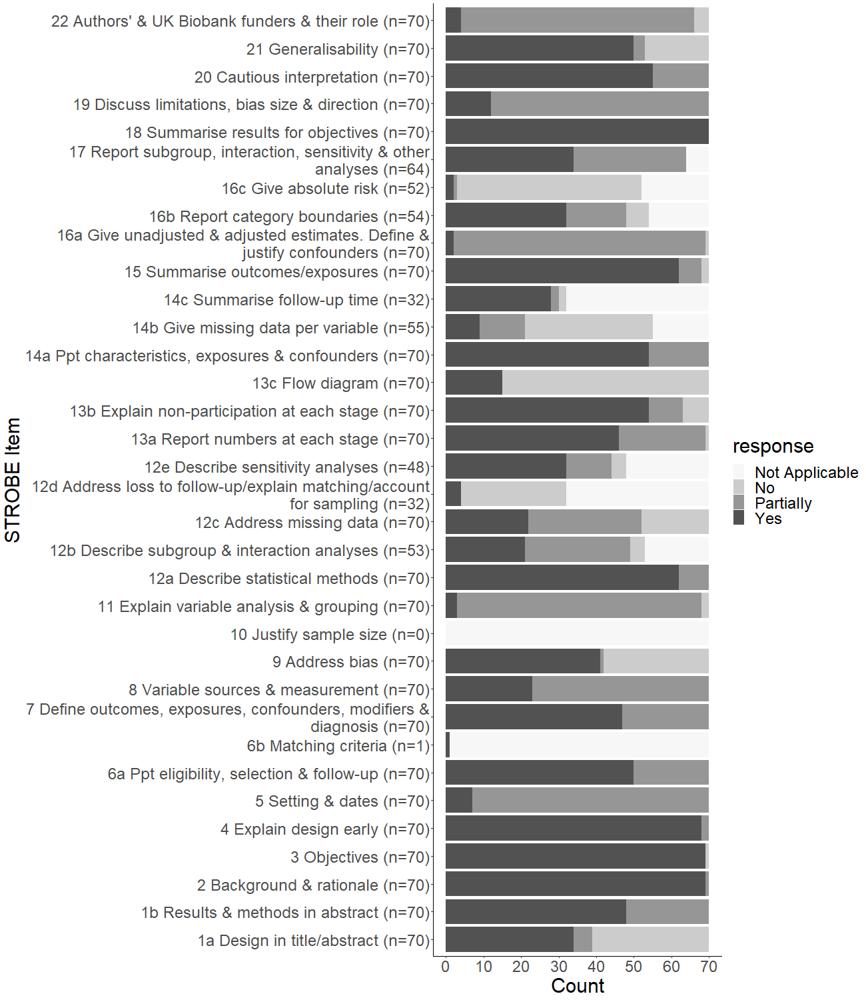

```{r setup, include=FALSE, echo=F}
knitr::opts_chunk$set(echo = F)

############
# libraries ####
#############
library(magrittr)
library(ggplot2)
library(tableone)
library(gtools)
library(tidyr)
library(RColorBrewer)
library(dplyr)
library(irr)
library(lpSolve)
library(kableExtra)
library(pander)

######################
# import  ####
######################


# save naming convention used for strobe item variables as a pattern to be used in grep

strobe_pattern <- "^s[[:digit:]]{1,2}"

import_recoded <- function(){
  # most variables are unordered factors (nominal with set responses) so read in with stringsAsFactors = T
  df_orig <- read.csv("../outputs/data-extraction-form-clean.csv", encoding = "UTF-8", na.strings = c(""), stringsAsFactors = T)
  df <- df_orig
  for(i in colnames(df)){
    # remove - from "Partially-External" as R doesn't like punctuation in factor levels
    x <- gsub("Partially-External", "PartiallyExternal", df[[i]]) %>%
      # make not applicable lowercase so doesn't clash with missing (NA) notation
      gsub("NA", "na", .) %>%
      # convert back into factor as gsub will have converted it to character
      as.factor(.)
    # check removed
    if(length(which(x == "Partially-External") != 0)) stop("some Partially-External remain in ", i)
    if(length(which(x =="NA") != 0)) stop("some not applicable values remain in ", i)
    df[[i]] <- x
  }
  return(df)
}

df <- import_recoded()

###################
# add presence cols ####
#####################

# add non-strobe cols indicating if non-strobe items present

add_pres <- function(df){
  df$ukb_app_pres <- !is.na(df$ukb_app)
  df$email_pres <- !is.na(df$email)
  df$keywords_pres <- !is.na(df$keywords)
  df$coi_pres <- !is.na(df$coi)
  # drop cols just created presence cols for as no longer needed for frequencies
  df <- df[, -which(colnames(df) %in% c("ukb_app", "email", "keywords", "coi"))]
  return(df)
}

df <- add_pres(df)

############
# drop non-strobe cols ####
#############

drop_cols <- function(){
  # remove predict col as df only contains non-prediction papers
  if(!any(df$predict == "Yes", na.rm = T)){
    df$predict <- NULL
  }else{
    stop("predict col not empty")
  }
  # drop access_article as this should be all yes
  if(all(df$access_article == "Yes")){
    df$access_article <- NULL
  } else {
    stop("access_article not just yes")
  }
  # save names of cols not needed 
  void <- grep("title|comments\\.", colnames(df), value = T)
  if(!all(void %in% colnames(df))) stop("df doesn't have ", void[!void %in% colnames(df)])
  # drop not needed cols by name
  df <- df[, -which(colnames(df) %in% void)]
}

df <- drop_cols()

# vector of original column names for checking later

if(sum(duplicated(colnames(df))) == 0){
  df_cols <- colnames(df)
} else {
  stop("duplicated col names")
}

########################
# save vector of strobe cols ####
########################

strobe_cols_names <- grep(strobe_pattern, colnames(df), value =T)

strobe_stem <- gsub("_.*", "", strobe_cols_names) %>%
  unique()
###################################
# split into strobe and non-strobe ####
#################################


# create funciton to check strobe items named & positioned correctly
check_strobe <- function(df){
  # find all strobe cols
  strobe_cols_positions <- which(colnames(df) %in% strobe_cols_names)
  # vector of numbers in strobe col names
  strobe_nums <- strobe_cols_names %>%
    # remove all punctuation and letters
    gsub("[[:punct:]]|[[:alpha:]]", "", .)%>%
    # remove duplicates
    unique()
  
  # check all strobe_nums are in 1-22
  if(!identical(unique(gsub("[[:alpha:]]", "", strobe_nums)), as.character(c(1:22)))){
    df <- NULL
    warning("strobe_nums don't equal 1-22")
  } 
  if(sum(duplicated(strobe_nums)) != 0){
    df <- NULL
    warning("duplicate strobe_nums")
  } 
  # check positions of strobe items are sequential (i.e. all positions have a diff of 1 between them)
  if(!all(abs(diff(strobe_cols_positions)) == 1)){
    df <- NULL
    warning("strobe items are not in sequential in df")
  } 
  return(df)
}

df <- check_strobe(df)

# if passes strobe check, separate df into strobe items and non-strobe items

s_df <- df[, which(colnames(df) %in% c("article_id", strobe_cols_names))]
not_s_df <- df[, -which(colnames(df) %in% strobe_cols_names)]

# check total ncol of s_df and not_s_df is same as original df +1 because article_id col is in both
if(ncol(s_df) + ncol(not_s_df) != ncol(df) +1) stop("wrong number of cols in strobe or not_strobe dfs")

#########################
# recode strobe factors ####
########################

# recode strobe variables into factors so can analyse later
factorise_strobe <- function(){
  # check strobe cols correct
  if(!all(strobe_cols_names %in% colnames(s_df))) stop("some strobe cols not in s_df")
  # save s_df before recoding factors
  pre_recode <- s_df
  # recode all strobe cols in s_df
  for(i in strobe_cols_names){
    # set all cols to factor
    s_df[[i]] <- as.factor(s_df[[i]])
    #recode all factor levels
    levels(s_df[[i]]) <- list(Yes = "Yes", PartiallyExternal = "PartiallyExternal", Partially = "Partially", No = "No", na = "na")
  }
  
  # check recode successful
  
  x <- c()
  
  for(i in strobe_cols_names){
    y <- all.equal(as.character(s_df[[i]]), as.character(pre_recode[[i]]))
    x <- c(x, y)
  }
  # check all cols identical as they were before recoding
  if(sum(x) != length(x) | length(x) == 0) stop("factor recoded cols in s_df are different to before recoding")
  # check factors created
  classes <- sapply(s_df, class)
  if(!any(classes == "factor")) stop("no factors created")
  return(s_df)
}

s_df <- factorise_strobe()


#######################
# divide strobe into ternary ####
########################

recode_strobe <- function(style = c("binary", "ternary")){
  # check style arg correct
  if(!style %in% c("binary", "ternary")) stop("style arg incorrect")
  
  # recode s_df
  x <- s_df
  
  # convert all cols into character variables
  x[] <- lapply(x, as.character)
  
  # get ids of all strobe cols
  id <- grep(strobe_pattern, colnames(x)) 
  
  # check all are characters
  for(i in id){
    if(is.character(x[, i]) == F) stop(i, "isn't a character")
  }
  # recode into binary
  if(style == "binary"){
    for(i in id){
      x[, i] <-  gsub("^Yes$", "1", x[, i]) %>%
        gsub("^No$|^Partially$|^PartiallyExternal$", "0", .) %>%
        gsub("na", NA, .) %>%
        as.numeric(.)
      if(is.numeric(x[, i]) == F) stop(i, "not numeric")
    }
  }
  # recode into ternary
  if(style == "ternary") {
    for(i in id){
      x[, i] <-  gsub("^Yes$|^PartiallyExternal$", "1", x[, i]) %>%
        gsub("^Partially$", "0.5", .) %>%
        gsub("^No$", "0", .) %>%
        gsub("na", NA, .) %>%
        as.numeric(.)
      if(is.numeric(x[, i]) == F) stop(i, "not numeric")
    }
  }
  #check strobe cols
  if(!all(strobe_cols_names %in% colnames(x))) stop("some strobe cols not in s_df_tri")
  
  return(x)
}

s_df_bin <- recode_strobe(style = "binary")
s_df_tri <- recode_strobe(style = "ternary")

#######################
# calculate strobe scores for ternary  ####
######################## 


sum_items <- function(df, style = c("binary", "ternary")){
  # check style arg correct
  if(!style %in% c("binary", "ternary")) stop("style arg incorrect")
  
  pre <- ncol(df)
  for(i in strobe_stem){
    # convert stem into pattern so don't get greedy matches e.g. s2 match s22
    pat <- paste0(c(paste0(i, "_"), paste0(i, "$")), collapse = "|")
    # save dataframe of variables for same strobe item so can sum rows
    x <- df[, grep(pat, colnames(df))]
    # create sum col name
    sum_name <- paste(i, "sum", sep = "_")
    # sum rows in x if it is a dataframe 
    if(!is.numeric(x)){
      sum_var <- rowSums(x, na.rm = T) / rowSums(!is.na(x))
    } else {
      # if not dataframe then no need to sum rows because only 1 col
      sum_var <- x
    }
    # check no rows dropped during summing
    if(length(sum_var) != nrow(df)) stop("missing some assessments")
    # make scores binary or ternary 
    if(style == "binary"){
      # force into binary by rounding down any less than 1 to indicate all yes/not yes
      sum_var[sum_var < 1] <- 0
    }
    if(style == "ternary"){
      # force into ternary by rounding any not 0 or 1 numbers to 0.5 to indicate partialness
      sum_var[sum_var >0 & sum_var < 1] <- 0.5
    }
    # add sum to df under sum_name
    df[[sum_name]] <- sum_var
  }
  
  
  if(ncol(df) != pre + length(unique(strobe_stem)))
    stop("cols don't equal number of n cols before function plus number strobe items")
  
  # drop all columns that are not summs composite strobe items and strobe items without subdivisions
  df <- df[, which(colnames(df) %in% c("article_id", grep("_sum$", colnames(df), value = T)))]
  
  # remove NaN values because rowSums will have introduced them
  is.nan.data.frame <- function(x)
    do.call(cbind, lapply(x, is.nan))
  
  df[is.nan(df)] <- NA
  
  # remove _sum from all colnames so matches strobe stems
  colnames(df) <- gsub("_.*", "", colnames(df))
  
  return(df)
}

tri_sum <- sum_items(s_df_tri, style = "ternary")
bin_sum <- sum_items(s_df_bin, style = "binary")


#####################
# create bar chart data ###
#######################

create_bar_data <- function(df){
  bar_data <- df[, which(colnames(df) %in% strobe_stem)]
  if(ncol(bar_data) != length(strobe_stem)) stop("some strobe items missing")
  # clean col names so will match names of strobe items in strobe guidance
  colnames(bar_data) <- colnames(bar_data) %>%
    gsub("^s|__sum|starred", "", .) 
  
  # change all to character to create table one
  bar_data[] <- lapply(bar_data, as.character)
  
  bar_data <- tidyr::pivot_longer(bar_data, colnames(bar_data), names_to = "strobe_item", values_to = "value") 
  x <- table(bar_data$strobe_item, bar_data$value, useNA = "always") %>%
    # convert to dataframe
    as.data.frame.matrix()
  y <- prop.table(table(bar_data$strobe_item, bar_data$value), 1) %>%
    # round so more interpretable
    round(., 2) %>%
    as.data.frame.matrix()

  # row names will contain the x values given to table(x, y), move these to a column >
  # remove the X added
  x$strobe_item <- gsub("^X", "", row.names(x))
  row.names(x) <- NULL
  
  y$strobe_item <- gsub("^X", "", row.names(y))
  row.names(y) <- NULL
  
  # useNA in x means there will be an blank column name for the NA values, rename this as won't pivot if any missing
  colnames(x)[is.na(colnames(x))] <- "na"
  # useNA also creates an "NA" row, remove this
  x <- x[-grep("NA", x$strobe_item), ]
  
  # save response cols so can pivot them
  x_cols <- colnames(x)[-which(colnames(x) %in% "strobe_item")]
  
  # create response column
  x <- pivot_longer(x, all_of(x_cols), names_to = "response", values_to = "count")
  
  # save response cols so can pivot them
  y_cols <- colnames(y)[-which(colnames(y) %in% "strobe_item")]
  
  # create response column
  y <- pivot_longer(y, all_of(y_cols), names_to = "response", values_to = "percent")
  
  # check strobe items identical so will merge properly
  if(!identical(unique(x$strobe_item), unique(y$strobe_item))) stop("x and y strobe items different")
  
  bar_data <- full_join(x, y, by = c("strobe_item", "response"), suffix = c(".count", ".percent"))
  
  # reorder
  bar_data <- bar_data[mixedorder(as.character(bar_data$strobe_item)),]
  
  return(bar_data)
}

bar_data <- create_bar_data(tri_sum)

#############################
# export data to create bar chart labels ####
##########################

create_bar_labels_csv <- function(){
  strobe_qs <- read.csv("../outputs/extraction_dict.csv", stringsAsFactors = F, encoding = "UTF-8") %>%
    .[, colnames(.) %in% c("question", "variable")] %>%
    # select those that are strobe items 
    .[grep("s[[:digit:]]{1,2}", .$variable), ] %>%
    .[-grep("\\_ev|\\_star", .$variable), ]
  
  strobe_qs$question <- sub("[^0-9]*", "", strobe_qs$question)
  strobe_qs$strobe_item <- sub("\\_.*", "", strobe_qs$variable)
  write.csv(strobe_qs, "../outputs/bar_labels.csv", row.names = F, fileEncoding = "UTF-8")
}

create_bar_labels_csv()

##############
## MANUAL ####
############

# MANUALLY INSTRUCTIONS
# added text describing the strobe item the bar_labels.csv

###########################
# import labels and clean ####
########################


create_labels <- function(){
  
  # import general as these contain labels at the strobe item level (not design specific)
  labels <- read.csv("../data/bar_labels.csv", encoding = "UTF-8", stringsAsFactors = F, na.strings = "") %>%
    .[, colnames(.) %in% c("variable", "item_level_label")]
  
  # clean variable names so matches bar_chart_freq colnames (i.e. no subdivisions and no design specific questions) >
  # easiest to do this by cleaning non-cohort specific quesitons first then cohort excluding 14c_coh since this contains no roman numerials and is not a sub division
  labels$variable <- gsub("_.*|starred|s", "", labels$variable)

  # remove duplicated rows now variables cleaned
  labels <- labels[!duplicated(labels),]
  # sort
  labels <- labels[mixedorder(as.character(labels$variable)),]
  
  # select applic col so can merge in
  applic_df <- bar_data[bar_data$response == "na", which(colnames(bar_data) %in% c("strobe_item", "count"))]
  
  # add applic col to labels rows only so can remove empty labels that are empty and wont appear in bar chart
  labels <- left_join(labels, applic_df, by = c("variable" = "strobe_item"))
  
  # add number of applicable items to labels so can see how many items were relevant in bar
  if(identical(labels$variable, 
               as.character(unique(bar_data$strobe_item)))){
    # paste variable together with description , separate by space so can gsub later
    labels$x_labels <- paste(labels$variable, labels$item_level_label, sep = " ") %>%
      # order
      .[gtools::mixedorder(.)]%>%
      # wrap
      stringr::str_wrap(., width = 55) %>%
      # add n = applicable on a newline
      paste(., " (n=", nrow(df) - labels$count, ")", sep = "")
  } else {
    stop("not identical")
  }
  return(labels)
}

labels <- create_labels()


#######################
## bar chart for all ####
##################
strobe_levels <-  bar_data$strobe_item[!duplicated(bar_data$strobe_item)]
# set levels as mixed order so order preserved in ggplot
bar_data$strobe_item<- factor(bar_data$strobe_item, levels = 
                                strobe_levels[gtools::mixedorder(strobe_levels)])

bar_data$response <- as.factor(bar_data$response)

# set levels using list so is accurate
levels(bar_data$response) <- list(NotApplicable = "na", No = 0, Partially = 0.5, Yes = 1)

# add space to NA level since can't do this in list
levels(bar_data$response)[levels(bar_data$response) == "NotApplicable"] <- "Not Applicable"

# check labels identical to strobe item numbers in labels$x_labels (gsub at the space) to ensure labels will map to chart
if(!identical(gsub(" .*", "", labels$x_labels), as.character(strobe_levels))) stop("labels won't map")

png("Rplot9.png", width = 1300, height = 1500)

# strobe item on x axis and plot % yes
bar_data %>%ggplot(aes(x=strobe_item, y=count, fill = response)) + 
  # blue fill
  geom_bar(stat="identity") +
  theme_classic() +
  theme(text = element_text(size=30))+
  scale_x_discrete(labels= labels$x_labels) +
  scale_y_continuous(breaks = seq(0, nrow(df), by = 10)) + 
  coord_flip() +
  xlab("STROBE Item") +
  ylab("Count") +
  ggtitle("Figure 1. STROBE completion")+
  scale_fill_brewer(palette = "Greys") +
  #geom_text(aes(label = count), vjust = 0, size = 8) +
  theme(plot.title = element_text(size = 22)) 
dev.off()


#####################
# calculate irr for NA and applicable ####
################################

inter <- read.csv("../outputs/data-extraction-form-conflicted.csv", na.strings = "")

create_kappa_df <- function(df){
  
  # save stems of variables that were not double coded (and therefore not conflicted)
  # kd alone extracted some variables so save all these variables single/unique variables
  single <- c("email","country","ukb_app","keywords","coi", "article_id") %>%
    #  qualtrics metadata, comments & title substring vars are unique to each coder so stems duplicated but not colnames >
    c(., "distribution_channel", "duration_in_seconds", "end_date", "finished", "progress", "recorded_date", "response_id", "response_type", "start_date", "user_language") %>%
    # remove those unique to each coder
    c(., "comments", "title_clean", "title_sub", "title")
  
  stem <- grep("\\.", colnames(df), value = T) %>%
    gsub("\\..*", "", .) %>%
    unique() %>%
    # remove single coded items since these can't be conflicted
    .[!. %in% single] %>%
    # remove predict because we already resolved these conflicts
    .[!. %in% "predict"] %>%
    # remove other variables that are not discrete
    .[!. %in% c("other_guidelines", "reg_id")] %>%
    # add '.' onto end so will match full word
    paste0(., "\\.")
  
  # save stems of duplicate and not applicable cols so can join back in
  na_items <- c("5_vi", "6a_iii", "10", "8starred_iii")
  na_stem <-  grep(paste0(na_items, collapse ="|"), stem, value =T)
  
  # remove all stems that are duplicate or not applicable as will throw error in kappa2 if set "NA" to missing and all are set to NA after qualtrics
  
  stem <- stem[-which(stem == na_stem)]
  #save empty objects so can save outputs from for loop
  kappa <- c()
  z <- c()
  p_value <- c()
  variable <- c()
  n_match <- c()
  n_conflicts <-c()
  n_na <- c()
  
  for(i in stem){
    x <- df[, grep(i, colnames(df))]
    y <- kappa2(x, weight = "unweighted")
    variable <- c(variable, i)
    kappa <- c(kappa, y$value)
    z <- c(z, y$statistic)
    p_value <- c(p_value, y$p.value)
    n_match <- c(n_match, sum(x[[1]] == x[[2]], na.rm = T))
    n_conflicts <- c(n_conflicts, sum(x[[1]] != x[[2]], na.rm = T))
    # count number of items with NA--NA dyads or notNA--NA dyads so are excluded from kappa
    n_na <- c(n_na, sum(is.na(x[[1]] != x[[2]])))
  }
  
  # bind objects into df so can render in manuscript
  irr_df <- data.frame(STROBEItem = variable, Kappa = kappa, Zstatistic = z, pvalue = p_value, Matches = n_match, Conflicts = n_conflicts, NotApplicableUnsure = n_na)
  
  # create df of empty varibles and bind to main df so will appear in table
  empty <- data.frame(STROBEItem = na_stem)
  irr_df <- full_join(irr_df, empty, by = "STROBEItem")
  
  # round all numeric cols so more interpretable
  nums <- colnames(irr_df)[colnames(irr_df) != "STROBEItem"]
  for(i in nums){
    x <- irr_df[[i]]
    if(!is.numeric(x)) stop(i, " col not numeric")
    x <- round(x, digits = 2)
    irr_df[[i]] <- x
  }
  
  # remove backslash that was added to variable names
  irr_df$STROBEItem <- gsub("\\\\.*", "", irr_df$STROBEItem)
  
  # reorder
  irr_df <- irr_df[gtools::mixedorder(irr_df$STROBEItem), ] 
    
  # set rownames to null to ensure none created
  row.names(irr_df) <- NULL
  
  return(irr_df)
}


# divide df into into NA and applicable

divide_na <- function(){
  for(i in colnames(inter)){
    x <- inter[[i]]
    x[x != "NA"] <- "A"
    inter[[i]] <- x
  }
  return(inter)
}

inter_na <- divide_na()
kappa_na <- create_kappa_df(inter_na)

#######################
# calculate strobe scores for ternary for inter  ####
######################## 

# split into kd and coder2 so can sum strobe items for each then rejoin
kd <- inter[, c("article_id", grep("\\.kd", colnames(inter), value = T))]
coder2 <- inter[, c("article_id", grep("\\.coder2", colnames(inter), value = T))]

sum_items <- function(df, coder_suffix){
  # set "NA" and "Unsure" as missing so calculations only apply to reporting judgements
  df[df == "NA" | df == "Unsure"] <- NA
  strobe_cols_names <- grep("^s[[:digit:]]{1,2}", colnames(df), value =T)
  
  # remove everything after _ or suffix
  strobe_stem <- gsub("_.*|\\..*", "", strobe_cols_names) %>%
    unique()
  
  pre <- ncol(df)
  
  for(i in strobe_stem){
    
    # save dataframe of variables for same strobe item so can sum rows
    x <- df[,grep(i, colnames(df))]
    # create sum col name
    sum_name <- paste0(i, "_sum", coder_suffix)
    # create empty sum_var to add values to in for loop
    sum_var <- c()
    # sum rows in x if it is a dataframe 
    if(!is.character(x)){
      for(j in 1:nrow(x)){
        if(all(x[j, ] %in% c("Yes", "Partially-External"), na.rm = T)) {
          sum_var[j] <- "Yes"
        } else {
          if(!all(x[j, ] %in% c("Yes", "Partially-External"), na.rm = T) & !all(x[j, ] == "No", na.rm = T)) {
            sum_var[j] <- "Partially"
          } else {
            if(all(x[j, ] == "No", na.rm = T)) {
              sum_var[j] <- "No"
            } else {
              stop(j, " in ", i, " doesn't contain just yes, pe, partially or no")
            }
          }
        }
      }
    } else {
      # if not dataframe then no need to sum rows because only 1 col
      sum_var <- x
    }
    # check no rows dropped during summing
    if(length(sum_var) != nrow(df)) stop("missing some assessments")
    # add sum to df under sum_name
    df[[sum_name]] <- sum_var
  }
  if(ncol(df) != pre + length(unique(strobe_stem)))
    stop("cols don't equal number of n cols before function plus number strobe items")
  
  # drop all cols that are not strobe sums & article id so can merge on id
  df <- df[, which(colnames(df) %in% c("article_id", grep("_sum", colnames(df), value =T)))]
  
  return(df)
}

kd <- sum_items(kd, ".kd")
coder2 <- sum_items(coder2, ".coder2")

inter_item <- full_join(kd, coder2, by = "article_id") %>%
  # reorder
  .[ , gtools::mixedorder(colnames(.))] %>%
  # remove article_id
  .[, -which(colnames(.) %in% "article_id")]

kappa_item <- create_kappa_df(inter_item)

kappa_item$STROBEItem <- gsub("^s|_.*|starred", "", kappa_item$STROBEItem)

```

# Abstract

Background


The STrengthening the Reporting of OBservational studies in Epidemiology (STROBE)
statement provides a reporting guideline for observational studies, including secondary analyses.
We aimed to use the STROBE guidelines to assess the reporting quality of studies using UK Biobank data.

Participants

70 cohort, cross-sectional and case-control studies published before 2019 were assessed using the STROBE guidelines.

Results
??? studies were identified, ??? were included and ??? were assessed. 

Conclusions

```{r, prisma}

# 4. questions picos


```


# Background

There is a general move towards making data freely accessible, or ‘open’, by academic and governmental institutions alike [@vasilevsky2017; @worldwidewebfoundation2018]. 
Completely open data allows any individual, regardless of their motivation, discipline or skillset, to access and analyse a dataset for free. 
This accessibility offers researchers new opportunities but there is also uncertainty about how the nature of open data may impact the reliability of research findings. 
One method by which the reliability of results from open data may be investigated is through replication. 
Direct replication of secondary data analyses is aided by the publication of an original analysis plan, in which the authors describe their statistical analysis in full. 
However, recent evidence suggests that it is unclear whether this is sufficient to ensure direct replicability of findings [@hardwicke2018; @naudet2018]. 

To investigate the reliability of findings from open data, we will attempt to replicate all eligible research articles that use UK Biobank (UKB) data. 
The UKB is a prospective cohort study which collected a wide range of health data from 500,000 people aged 40-69 in the UK during 2006-2010 [@ukbiobankcoordinatingcentre2007].
Importantly, UKB data is partially open data because it is only available to bona fide researchers conducting research in the public interest on a cost-recovery basis.
The UKB reserves the right to reject access applications for projects it deems inappropriate [@ukbiobankcoordinatingcentre2011].
We first conducted a systematic review to (1) assess the completeness of UKB study reporting, (2) identify articles that are suitable for replication, and (3) inform reporting guidelines for other articles using the UKB and similar resources. 
We will evaluate reproducibility of studies conducted in the UKB given the abundance of published articles using data from this cohort and their contemporary nature, increasing the likelihood that authors will be contactable.
Furthermore, they all use the same, professionally collected, maintained and diverse open resource. 
This guarantees data accessibility and usability and means that differences between the original and replication results cannot be explained by poor data curation or heterogeneity between studies.

Many previous systematic reviews of reporting standards across a range of disciplines used guidelines to assess the completeness of reporting [e.g. @agha2014; @cook2011; @plint2006).
We used the STROBE (STrengthening the Reporting of Observational Studies in Epidemiology) Statement, which provides reporting guidelines for observational studies, to evaluate articles arising from UKB and to make comparisons between the articles. 
The STROBE Statement has been endorsed by over 100 journals and, as no major changes have been made to the original version published in 2007 [@cevallos2014], these guidelines are relevant to all studies conducted using the UKB.
Given that studies conducted using UKB may be cohort, cross-sectional or ‘nested’ case-control, the review used the combined STROBE Statement for cohort, cross-sectional and case-control designs, and its extensions, to assess the reporting standards in UKB articles.

We aimed to conduct a systematic review of articles reporting studies using data from the UKB with the aim of answering the following questions:

1. What is the quality of reporting of findings from the UKB (in terms of the detail, clarity and completeness with which authors report their design, analysis and results)?
2. Does reporting quality vary across the type of studies conducted?

# Methods

## Protocol registration

This study was preregistered before we began to screen the search results [@drax2019].

## Eligibility criteria

Eligible articles are full research articles that report analyses of UKB data. Each article that is excluded at the full-text level of screening will be listed with the reason for exclusion.

Inclusion criteria:

* Publication date: After 30 March 2012. 
This is the date the UKB was launched and UKB data was first available beforehand.
* Publication type: Full research articles (including simulation and modelling articles).
* Language: English. Relevant studies written in another language may be eligible but, to ensure accurate and precise evaluation, the article would require a professional translation which is not feasible given the review’s resources.
* Data source: Article’s findings were produced from analysis(es) of data from the UKB. 
This includes studies which reported findings from other studies alongside findings from UKB data.

Exclusion criteria:

* Article findings were produced from analysis(es) of pooled data from multiple studies.
These are studies which have used data from participants from the UKB and other datasets in the same analysis.
* Meta-analyses; narrative and systematic reviews; preprints; post-prints; replies; letters to the editor; corrections; and any other publication types that are not full research articles.
* Retracted articles

## Information sources and search strategy

Four databases were electronically searched on 15/01/2019 for UKB articles: PubMed, EMBASE, Web of Science Core Collection (WoSCC) and PsycINFO. 
The search strategy was limited to articles published from 2012 onwards and there was no restriction on language or publication type.

The full search strategy for each database is included in Appendix A of the protocol [osf ref]. 
To summarise, the terms "UK Biobank", "UKB", "UKBiobank", and "UKB Resource" were included in the "Title", "Abstract", "Keywords", and "All Fields" fields or equivalent of each database.


```{r}
# is there counts for the number of articles from th eUKB list? 


```

## study selection

We conducted four stages of screening for eligibility.
First, using Endnote, KD removed duplicate results, checked the results for completeness, updated the metadata if necessary, and retrieved the full-texts of all results.
KD checked completeness using a list of published full research articles that have used the UKB Resource, provided by the UKB on 27 November 2018. 
Using the full-texts of the results, KD assessed if results were full research articles, and excluded reviews, corrections, conference abstracts, etc.


Second, the results were imported into Rayyan [@ouzzani2016] and screened by BW and KD to determine whether they met the inclusion criteria.
If insufficient information was available to determine a paper’s eligibility, the authors were contacted to request the required information. 
If this information was unobtainable, the article was excluded.
Time constraints meant we excluded some articles with insufficient information without contacting the authors.

Third, We classified studies as "traditional epidemiology", "Mendelian randomisation" and "Other", according to the type of data they analysed.
After being piloted on 20 studies, the classification criteria were:

*	Traditional epidemiology – studies investigating associations between exposures and health outcomes using the UK Biobank data alone. 
*	Mendelian randomisation – studies that conduct Mendelian randomisation analyses on UK Biobank data alone
*	Other – articles that do not meet the ‘Traditional epidemiology’ or ‘MR’ classification criteria described above or include analyses of genetic or imaging data.

Articles abstracts were classified independently by MG and KD. 
Full texts were examined where classification is unclear from the abstract.
Any conflicts were discussed by KD and BW and resolved by mutual consent if possible. 
If not resolved after discussion RR assign the category.
Articles could be allocated into more than one classification group.
We then excluded all but the traditional epidemiology studies.
The Mendialian randomisation studies were not relevant to this paper but we included it as a classification because the data may be used for one of our author's future projects.

Only including observational epidemiological studies is a major departure from the protocol in which we stated that studies would be "classified according to their data type" during data extraction but that all classifications would be included.
This was so we could analyse articles according to their appropriate STROBE extension, such as the strengthening the reporting of genetic association studies (STREGA) statement [@little2009].
Given that it would be too time-consuming to extract data from all studies in all included articles and to design multiple data extraction forms, we decided to extract data and assess the reporting quality of studies that could be assessed using the original STROBE guidelines only, i.e. traditional epidemiology studies. 

Fourth, we catergorised the 178 studies classified as observational epidemiological studies into those with cohort, case-control and cross-sectional study designs using the Study Design Form described below.
During this process KD also examined the notices attached to the online version of the observational epidemiology articles to identify any retracted articles. 
None were identified.
However, we did identify studies that should be excluded, these studies were:

* Studies incorrectly classified as observational epidemiological studies.
* Studies with inaccessible supplementary material
* Studies we did consider to be observiational epidemiological studies but could not consider them to have cohort, case-control or cross-sectional designs - for example those using prediction models

## Data collection process

### Study Design Form

Different STROBE items are relevant for cohort, case-control and cross-sectional study designs. 
To ensure coders completed the same STROBE items for each article KD and MG independently identified the study designs used by each of the 178 “observational epidemiology” articles by completing the Study Design Form for each article.
In the form, extractors also indicated if all supplementary material can be accessed via University of Bristol subscriptions. 
Any conflicts were discussed by the two extractors and resolved by mutual consent if possible.
If not resolved after discussion, RR determined the study designs. 
The Study Design Form was hosted on Qualtrics but a PDF version can be found at https://osf.io/jfk24/.

The articles were randomly assigned an ID number from 1-178. 
The articles with an ID number between 1 and 80 were selected for the first round of data extraction. 
KD was assigned as the first extractor to all 80 articles. 
The second extractor was randomly assigned from MG, RR or BW.
We initially randomly selected 80 articles with the hope that we would randomly select more studies once data extraction for the first 80 were complete.
Unfortunately we did not have time to assess more studies. 

### Data Extraction Form

The Data Extraction Form was hosted on Qualtrics and piloted twice. 
This form combined the data items described as part of the "Data Extraction Form" and "Reporting Quality Assessment" in the protocol, but not all were kept.
In the first, 5 observational epidemiology articles were piloted by MG, KD and/or RR. 
Major changes were made so the Data Extraction Form will be completed again for the articles in the first pilot. 
In the second, KD piloted the changed form on 3 articles. 
No changes were made so the responses for articles in the second pilot were retained.

The extractors independently completed the Data Extraction Form for each article assigned to them.
Initially, any conflicts were discussed by the two extractors and resolved by mutual consent if possible. 
If not resolved after discussion, RR resolved the conflict.
However, given the number of conflicts this could not be sustained.
To reduce the time-burden on other authors KD and RR devised a series of "rules" and general guidelines KD could use to resolve conflicts by herself. 
This means the majority of conflicts were resolved by these "Rules" or KD's own judgement.
An explanation of the rules and guidelines can be found at https://osf.io/hngcj/.

### Other data collection

The items in Table 1 were extracted manually by KD or automatically by Endnote which contained the article’s metadata exported from the database the article was located in.

### Unclear and Missing Information.

In our protocol we planned to locate and examine publications linked to the article, e.g. related full research articles, comments, corrections, etc, so that we could retrieve any missing items in the Data Extraction Form from them.
If the missing information is not contained in a linked publication we planned to contact the article’s authors.
However, we realised this would give an inaccurate assessment of the verision of record. 
Also few articles had linked publications and that there was a lot of missing or unclear information.
Therefore, we did not attempt to retrieve any missing items in the Data Extraction Form, from either the authors or linked articles. 

# Results 

## Study selection


## Study characteristics

Of the `r nrow(df)` included studies `r sum(grepl("Case-control", df$designs))` contained case-control designs, `r sum(grepl("Cohort", df$designs))` cohort, and `r sum(grepl("Cross-sectional", df$designs))` cross-sectional. These numbers add up to more than 70 because some articles contained cross-sectional and cohort studies.
UK based researchers led the vast majority with `r sum(grepl("UK", df$country, ignore.case = F))` having authors affiliated with institutions in the UK.
`r sum(grepl("2014", df$year))` studies were published in 2014, `r sum(grepl("2015", df$year))` in 2015, `r sum(grepl("2016", df$year))` in 2016, `r sum(grepl("2017", df$year))` in 2017, `r sum(grepl("2018", df$year))` in 2018, and `r sum(grepl("2019", df$year))` in 2019.

## STROBE Reporting quality

Using the data extraction form on Qualtrics, we assessed reporting quality separately for all subdivisions of the STROBE items and for the “starred” items associated with any STROBE items that had an asterisk (*) next to it. 
For the final analysis, we excluded all starred subdivisions because inter-rater reliability was so poor and the applicability of the items was often uncertain. 
We then summed the subdivisions to indicate the reporting quality of each STROBE item, these results are presented in Figure 1. 
For completeness, the results for the subdivisions are available in Supplementary Table 2.

We originally assessed reporting quality separately for all subdivisions of the STROBE items.
The results for the subdivisions are reported in Supplementary Table 2.



```{r assistance}

bad <- as.data.frame(bar_data) %>%
  .[order(as.character(.[,2]), .[,3]), ] %>%
  .[-which(.$response == "Yes" & .$count > 30), ] %>%
  .[-which(.$response == "No" & .$count < 20), ] %>%
  .[-which(.$response == "Not Applicable"), ]

good <- as.data.frame(bar_data) %>%
  .[order(as.character(.[,2]), .[,3]), ] %>%
  .[-which(.$response == "Yes" & .$count < 30), ] %>%
  .[-which(.$response == "No" & .$count > 20), ] %>%
  .[-which(.$response == "Not Applicable"), ]

bad <- c("5", "8", "11", "12b", "12c", "16a", "19", "22", "12d", "13c", "14b", "16c", "1a", "9")

good <- unique(bar_data$strobe_item[!bar_data$strobe_item %in% bad])
```

Figure 1 shows the best reported items are 2, 3, 4, 12a, and 18 with nearly all articles reporting each item fully.
The good reporting of the main statistical methods suggested by 12a is encouraging for the reproducibility of the analyses.
Most articles also fully reported item 21.

Items 5, 8, 11, 12c, 16a, 19 and 22  were dominated by partial reporting.
For some this is not a major concern.
Items 5 and 8 relates to the setting, recruitment, location, dates, and assessment methods of the UK Biobank data collection.
Although it does not meet the STROBE guidelines, all information for item 5 and 8 is fully reported in the publically available UK Biobank documentation.

Other results indicate more uncertainty for the reproducibility of the included studies. 
Authors poorly reported how they handled their variables (item 11) and missing data (item 12c).
Another potential area of concern is the reporting of sensitivity, subgroup, interaction, and other analyses.
Most reporting of the methods (items 12b and 12e) and results (item 17) from these analyses was incomplete. 
Both of these issues could limit the reproducibility of UK Biobank analyses.

Other items that were poorly reported do not pose the same concerns for reprodu
In Figure 1, item 16a appears to be a potential cause for concern.
Supplementary Table 2 shows that while nearly all authors fully report their confounder-adjusted estimates most are failing report their unadjusted elements and to justify why they included the confounders they did.  
This poses less threats to estimating reproducibility of the results but does suggest a widespread norm of researchers including confounders without a stated justification.
Similarly the poor reporting of item 19 and 22 provide few threats to the reproducibility of the methods but suggest researchers are not expected to provide detailed information on potential bias or report the role of funders in their studies.

The worst reported items were 12d, 13c, 14b and 16c, with most authors reporting no information about them.
Again the implications are of varying concern for different items.
Figure 1 shows few authors reported addressing loss to follow up in item 12d.
This could be because many studies used NHS data linked to the UK Biobank as follow up data so the studies are likely to have low loss to follow up.
Although confirming this will require further investigation into the individual studies.
The impact of rare reporting of flow diagrams (item 13c) is also tempered by the good results for 13a and 13b, as it suggests authors do report the information just not in a flow diagram.
Authors are poor at reporting absolute risk estimates (16c) and missing data (14c).


```{r to-do}

# CHECK OTHER STEMS ARE NOT BEING GREEDY
# REMOVE ACCOUNT FOR SAMPLING FROM 12D LABEL?
```


**  12b - fv serious element so worrying

lots of nos, lots of yes, few partial
* 1a, 9, 


We calculated kappa statistics to estimate the inter-rater reliability for each of the STROBE items, these are presented in Table 1.

```{r table1}

doc.type <- knitr::opts_knit$get('rmarkdown.pandoc.to')

if(doc.type == "docx"){pander(kappa_item, caption = "Table 1. Inter-rater reliability for the STROBE items")} else {kable(kappa_item)}

```

## Other reporting quality

We collected reporting quality data in addition to the STROBE items.
We intended to conduct exploratory analyses using these variables, for example comparing articles that reported using some form of reporting guidelines to those who did not.
We did not conduct an exploratory analyses into the relationships between these variabels because subgroup analyses for all of these variables would have very small subgroup samples. 
Instead we report the descriptive statistics for each variable in Table 2 below.

*Table 2. Descriptive statistics for additional reporting quality variables*

```{r table2, echo=F, include = F}

###################
# frequencies non-strobe ####
##################

# save version of not strobe df without qualtrics metadata variables to create table 2

create_table2 <- function(){
  # save pattern to find qualtrics variables
  qual <- c("distribution_channel", "duration_in_seconds", "end_date", "finished", "progress","recorded_date", "response_id", "response_type", "start_date", "user_language")
  qual_pat <- paste0("^", qual, ".", collapse = "|")
  
  # find qualtrics columns in df
  qual_cols <- grep(qual_pat, colnames(not_s_df))
  
  # check there are 4 of each qual column
  if(length(qual_cols) != 4* length(qual)) stop("some qualtrics cols missing")
  
  table2 <- not_s_df[, -qual_cols]
  
  # drop cols that are qualitative so contain unique info for each observation so no point in calculating frequencies
  table2 <- table2[, -which(colnames(table2) %in% c("article_id", "correction_address", "open_access_address", "reg_id", "correction_address"))]
  
  #convert all non-strobe cols into characters as easier than setting multiple different factor levels
  for(i in colnames(table2)){
    table2[[i]] <- as.character(table2[[i]])
  }
  
  # ensure UK and USA country values are capitalised as frequency is case-sensitive
  uk_usa <- grep("^uk$|^usa$", table2$country, ignore.case = T)
  table2$country[uk_usa] <- toupper(table2$country[uk_usa])
  
  # drop cols that are characteristics
  chars <- c("designs", "country", "year")
  if(!all(chars %in% colnames(table2))) stop("missing char elements in colnames")
  table2 <- table2[, -which(colnames(table2) %in% chars)]
  
  # set missing & na as won't make a difference to absolute numbers
  table2[is.na(table2)|table2 == "na"] <- "Not Applicable"
  table2[table2 == "ni"] <- "No information"
  table2[table2 == "TRUE"] <- "Yes"
  table2[table2 == "FALSE"] <- "No"
  
  # rename table2 colnames so will come out as full words in createtableon
  colnames(table2)[colnames(table2) == "code"] <- "Report shared analysis code"
  colnames(table2)[colnames(table2) == "exposure"] <- "Exposures reported as exposures"
  colnames(table2)[colnames(table2) == "outcome"] <- "Outcomes reported as outcomes"
  colnames(table2)[colnames(table2) == "reg"] <- "Report analyses registered"
  colnames(table2)[colnames(table2) == "strobe"] <- "Report using STROBE guidelines"
  colnames(table2)[colnames(table2) == "strobe_cite"] <- "Cite STROBE guidelines if used"
  colnames(table2)[colnames(table2) == "ukb_credit"] <- "Report UK Biobank credit statement correctly"
  colnames(table2)[colnames(table2) == "var_id"] <- "Report UK Biobank variable IDs"
  colnames(table2)[colnames(table2) == "other_guidelines"] <- "Report using reporting guidelines other than STROBE"
  colnames(table2)[colnames(table2) == "open_access_publisher"] <- "Published as open access"
  colnames(table2)[colnames(table2) == "correction"] <- "Has a correction"
  colnames(table2)[colnames(table2) == "ukb_app_pres"] <- "Report UK Biobank application number" 
  colnames(table2)[colnames(table2) == "email_pres"] <- "Has email address for corresponding author"
  colnames(table2)[colnames(table2) == "keywords_pres"] <- "Has keywords"
  colnames(table2)[colnames(table2) == "coi_pres"] <- "Report conflict of interest statement"
  colnames(table2)[colnames(table2) == "access_supp"] <- "Has supplementary material"
  
# drop retraction col because none should be
  table2 <- table2[, -which(colnames(table2) %in% "retraction")]
  return(table2)
}


table2 <- create_table2()


CreateTableOne(data = table2, includeNA = F) %>%
  print(., noSpaces = T) %>%
  write.csv(., "../outputs/table2.csv")

```
# Discussion


## Summary

## Limitations

## Conclusions

# Funding Source

This review is being funded by the John Climax Benevolent Fund. 
The funder will support the conduct of the review by paying KD’s stipend. 
The funder had no input on any aspect of the project, such the protocol design, data collection, data analysis nor interpretation or publication of results.


# Conflicts of Interest
There are no conflicts of interest to report.

# Supplementary Material

## Supplementary Table 2

```{r SuppTable2}

create_stab2 <- function(){
  stab2 <- df[, which(colnames(df) %in% c(strobe_cols_names))]
  # convert all to characters so can easily reset values and table will just treat as nominal
  for(i in colnames(stab2)){
    stab2[[i]] <- as.character(stab2[[i]])
  }
  
  # set missing to na as won't make a difference to absolute numbers
  stab2[is.na(stab2)|stab2 == "na"] <- "Not Applicable"
  stab2[stab2 == "PartiallyExternal"] <- "Partially-External"
  
  
  # pivot so can table frequencies
  stab2 <- tidyr::pivot_longer(stab2, colnames(stab2), names_to = "strobe_item", values_to = "value") %>%
    # reorder so follows strobe order
    .[mixedorder(as.character(.$strobe_item)), ]
  
  # remove s from strobe item
  stab2$strobe_item <- gsub("^s", "", stab2$strobe_item)
  
  # table
  stab2 <- table(stab2$strobe_item, stab2$value, useNA = "ifany") 
  
  return(stab2)
}

stab2 <- create_stab2()

if(doc.type == "docx"){pander(stab2, caption = "Supplementary Table 2. Descriptive statistics for reporting quality of subdivisions of all STROBE items")} else {kable(stab2)}
```


  
# References